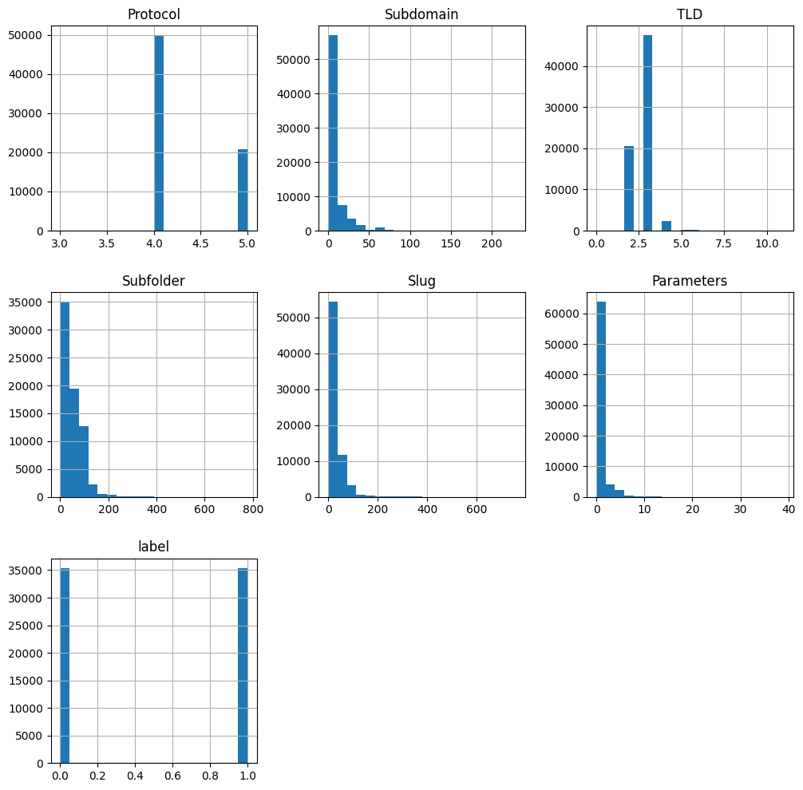
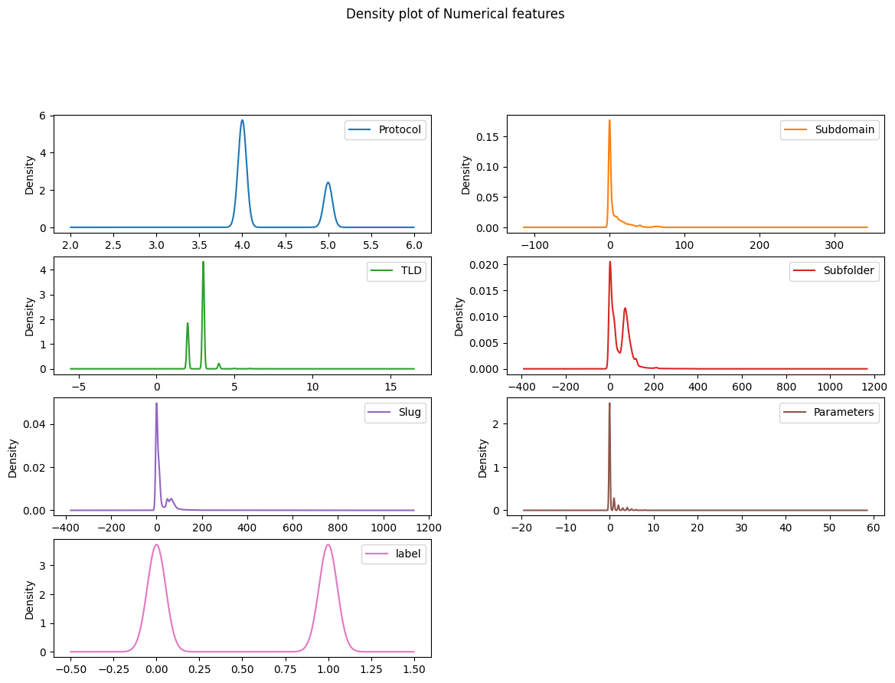
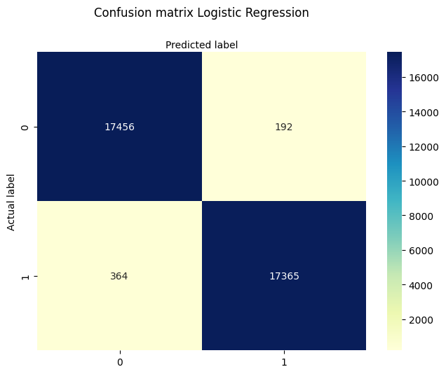
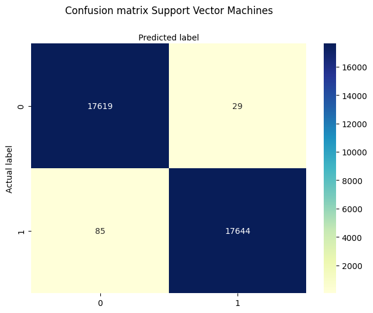

# Phishing URL Detection Machine Learning Model

## Table of Contents
  1. [Introduction](#introduction)<br>
  2. [Datasets](#datasets)<br>
  3. [Exploratory Data Analysis](#eda)<br>
  4. [Feature Extraction](#feature-extraction)<br>
  5. [Train Test Split](#train-test-split)<br>
  6. [Logistic Regression](#logistic-regression)<br>
  7. [Support Vector Machines (SVM)](#svm)<br>
  8. [Testing](#testing)<br>
  9. [Summary](#summary)

## <a name="introduction"> Introduction</a>
This project focuses on detecting phishing URLs using machine learning techniques, specifically the Logistic Regression and Support Vector Machines (SVM) models from the scikit-learn library. In addition to these models, Natural Language Processing (NLP) techniques are applied to enhance the detection accuracy. The project aims to provide an efficient and user-friendly solution for identifying potential phishing URLs.

## <a name="datasets"> Datasets</a>
For training and evaluating the phishing URL detection model, we utilized multiple datasets from various sources. The primary datasets were obtained from the University of New Brunswick (UNB) URL Datasets (https://www.unb.ca/cic/datasets/url-2016.html), while additional phishing URLs were obtained from Phishtank Developer Info (https://www.phishtank.com/developer_info.php).

The datasets from UNB included:
 -  Legitimate URLs: A collection of over 35,000 genuine and legitimate URLs.
 -  Phishing URLs: An initial set of less than 10,000 phishing URLs.

To address the data imbalance, we augmented the dataset by incorporating an additional over 25,000 phishing URLs sourced from Phishtank, ensuring a more balanced representation of phishing data. This increase the total number of URLs to 70,754.

## <a name="eda"> Exploratory Data Analysis</a>
We conducted exploratory data analysis (EDA) to gain insights from the extracted features and represented the findings using bar charts. The bar charts visually illustrate the distribution and characteristics of each feature (except the Domain feature), providing a comprehensive understanding of the data.






## <a name="feature-extraction"> Feature Extraction</a>
We selected specific features to extract from the URLs for further analysis. The following features were chosen based on a URL structure:
 -  Protocol
 -  Subdomain
 -  Domain
 -  Top-level domain
 -  Subfolder
 -  Slug
 -  Parameters
These features are then combined into a structured dataset, enabling the machine learning models to learn and make predictions effectively.

## <a name="train-test-split"> Train Test Split</a>
The dataset is randomly divided into a training set and a test set, with a 75% - 25% ratio. This ensures that the model is trained on a sufficient amount of data while allowing for a robust evaluation of unseen data. The distribution of target labels in the training set is checked to verify that it is relatively balanced.
```python
# Calculate the distribution of target labels in the training set
train_label_counts = {
    '0': (y_train == 0).sum(),
    '1': (y_train == 1).sum()
}
print('Label 0 count:', train_label_counts['0']) # Label 0 count: 26492
print('Label 1 count:', train_label_counts['1']) # Label 1 count: 26573
```
In this case, there is a slight difference in the counts of label 0 and label 1, but the difference is insignificant. The counts are relatively balanced, with label 1 having a slightly higher count than label 0.

## <a name="logistic-regression"> Logistic Regression
The Logistic Regression model is employed with optimized parameters obtained through grid search. The model is trained using the training set and subsequently tested on the test set. The model's performance is assessed based on accuracy, F1 score, and Jaccard score, providing insights into its effectiveness in phishing URL detection.
```python
logreg = LogisticRegression(C= 0.01, class_weight= 'balanced', max_iter= 500, penalty= 'l2', random_state=42)
lr_lbfgs = logreg.fit(x_train,y_train)

y_pred_lr=logreg.predict(x_test)
```
The accuracy, scores, and confusion matrix of the prediction are as follows:
- Accuracy: 0.9843
- F1 score: 0.9842
- Jaccard score: 0.9691



## <a name="SVM"> Support Vector Machines (SVM)</a>
In addition to Logistic Regression, Support Vector Machines (SVM) are used as an alternative machine learning model for phishing URL detection. The SVM model is trained and evaluated similarly to Logistic Regression, allowing for a comparison of their performance.
```python
clf = svm.SVC()
clf_md = clf.fit(x_train, y_train)

y_pred_svm = clf.predict(x_test)
```
The accuracy, scores, and confusion matrix of the prediction are as follows:
- Accuracy: 0.9968
- F1 score: 0.9968
- Jaccard score: 0.9936



## <a name="testing"> Testing</a>
The trained models are put to the test using an external dataset containing URLs with their corresponding labels. Feature extraction is applied to this dataset, and both the Logistic Regression and SVM models are used to make predictions. The performance of the models on this test dataset is evaluated, providing an assessment of their real-world applicability.

The TEST accuracy, scores, and confusion matrix of the prediction by <strong>Logistic Regression</strong> model is as follows:
- Jaccard score: 0.05
- Accuracy: 0.49
- F1 score: 0.65


The TEST accuracy, scores, and confusion matrix of the prediction by <strong>SVM</strong> model are as follows:
- Jaccard score: 0.05
- Accuracy: 0.49
- F1 score: 0.65


## <a name="testing"> Summary</a>
In summary, this project combines data preprocessing, feature extraction, exploratory data analysis, and machine learning techniques to create an effective phishing URL detection model. The utilization of Logistic Regression and SVM, along with careful feature selection, ensures a robust and reliable solution for identifying potential phishing URLs. But the result is not meeting the expectations and further justification will be provided.
