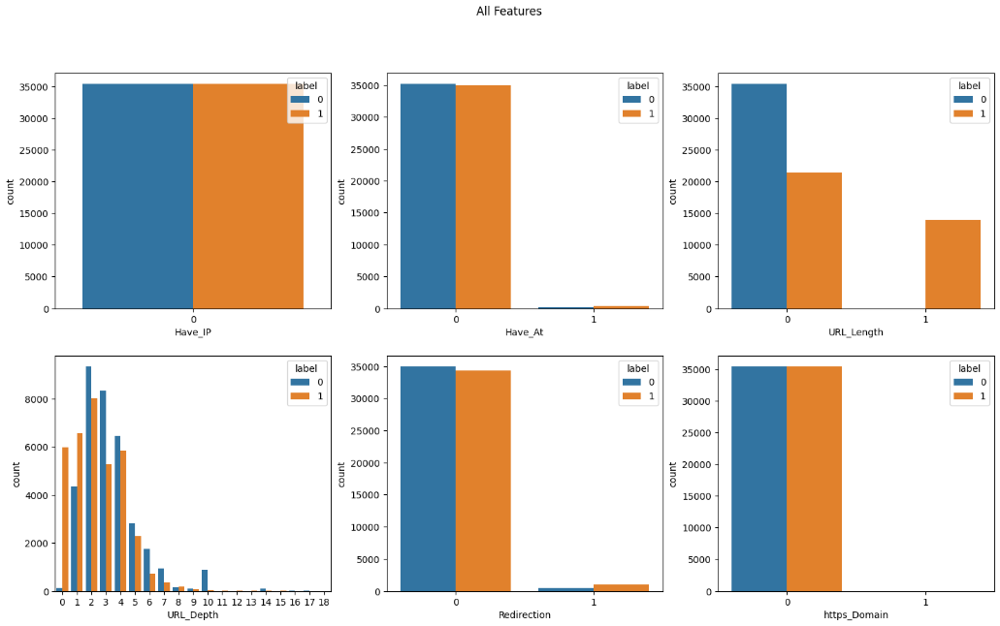

# Phishing URL Detection Machine Learning Model

## Table of Contents
  1. [Introduction](#introduction)<br>
  2. [Datasets](#datasets)<br>
  3. [Exploratory Data Analysis](#eda)<br>
  4. [Train Test Split](#train-test-split)<br>
  5. [Logistic Regression](#logistic-regression)<br>
  6. [Bernoulli Naive Bayes](#naive-bayes)<br>
  7. [Evaluation](#evaluation)

## <a name="introduction"> Introduction</a>
This repository contains a machine-learning model for detecting phishing URLs. The model uses [sklearn]'s Logistic Regression to classify URLs as either legitimate or phishing.

## <a name="datasets"> Datasets</a>
For training and evaluating the phishing URL detection model, we utilized multiple datasets from various sources. The primary datasets were obtained from the University of New Brunswick (UNB) URL Datasets (https://www.unb.ca/cic/datasets/url-2016.html), while additional phishing URLs were obtained from Phishtank Developer Info (https://www.phishtank.com/developer_info.php).

The datasets from UNB included:
 -  Legitimate URLs: A collection of over 35,000 genuine and non-malicious URLs.
 -  Phishing URLs: An initial set of more than 9,000 fraudulent URLs.

To address the data imbalance, we augmented the dataset by incorporating additional datasets provided by UNB. These datasets included spam, malware, and defacement URLs, which increased the total count to over 24,500 URLs. Furthermore, we obtained an additional 11,000 phishing URLs from Phishtank, ensuring a more balanced representation of phishing data.

## <a name="eda"> Exploratory Data Analysis</a>
We selected specific features to extract from the URLs for further analysis. The following features were chosen:
 -  Domain
 -  Have_IP
 -  Have_At
 -  URL_Length
 -  URL_Depth
 -  Redirection
 -  https_Domain

To gain insights from the extracted features, we conducted exploratory data analysis (EDA) and represented the findings using bar charts. The bar charts visually illustrate the distribution and characteristics of each feature (except the Domain feature), providing a comprehensive understanding of the data.



Upon evaluation, the decision was made to incorporate only URL_Length and URL_Depth into the model. This decision was made based on the limited availability of data in the other features, where either the data did not sufficiently represent both labels or the features held limited significance in the context of the study. Therefore, URL_Length and URL_Depth were deemed the most relevant and informative features for the model.

## <a name="train-test-split"> Train Test Split</a>
The dataset was randomly divided into a training set and a test set, with a ratio of 75% for the training set and 25% for the test set. After splitting the dataset into a training set and a test set, we examined the distribution of target labels in the training set to check for any bias:
```python
# Calculate the distribution of target labels in the training set
train_label_counts = {
    '0': (y_train == 0).sum(),
    '1': (y_train == 1).sum()
}

print('Label 0 count:', train_label_counts['0']) # Label 0 count: 26492
print('Label 1 count:', train_label_counts['1']) # Label 1 count: 26573
```
In this case, there is a slight difference in the counts of label 0 and label 1, but the difference is not significant. The counts are relatively balanced, with label 1 having a slightly higher count than label 0.

## <a name="logistic-regression"> Logistic Regression
Writing...

## <a name="naive-bayes"> Bernoulli Naive Bayes
Writing...

## <a name="evaluation"> Evaluation
Writing...

